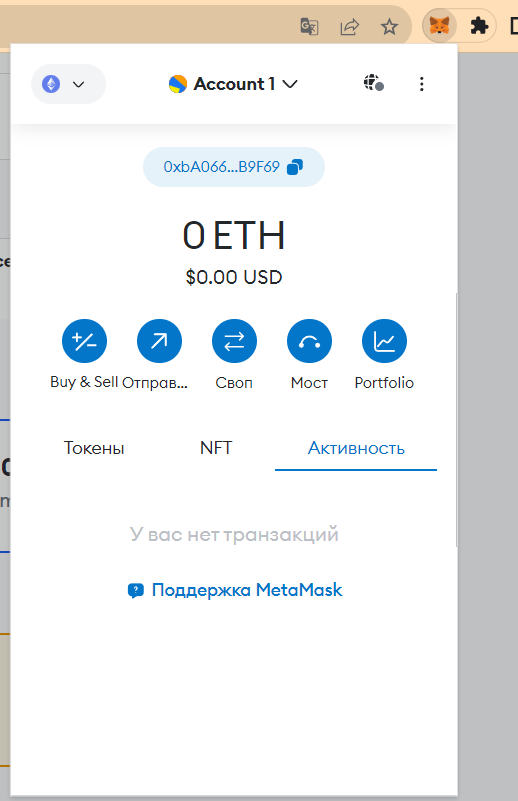
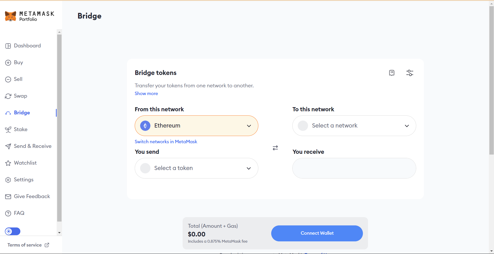
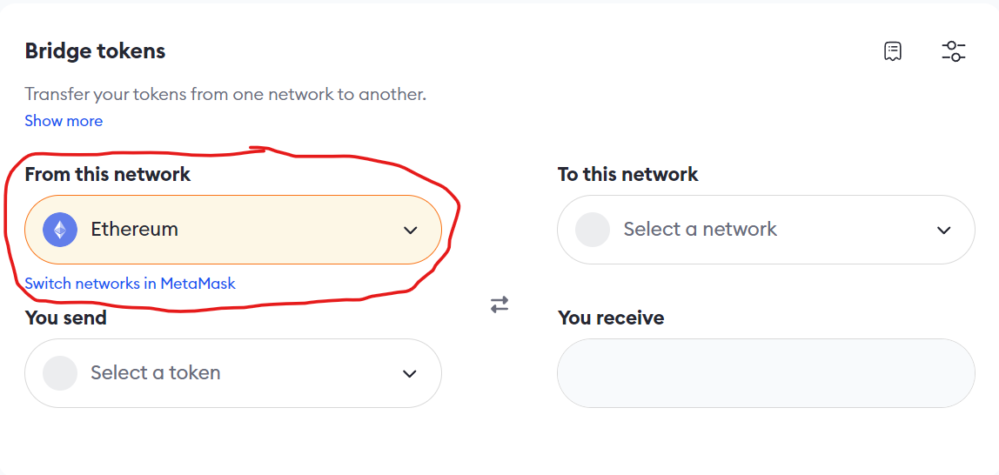
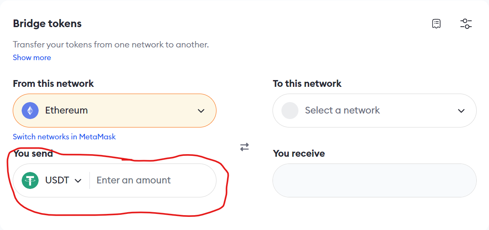
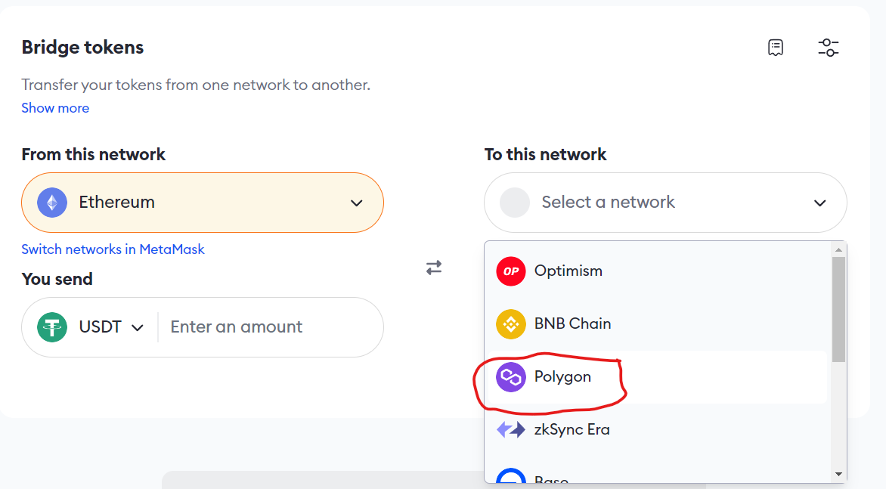
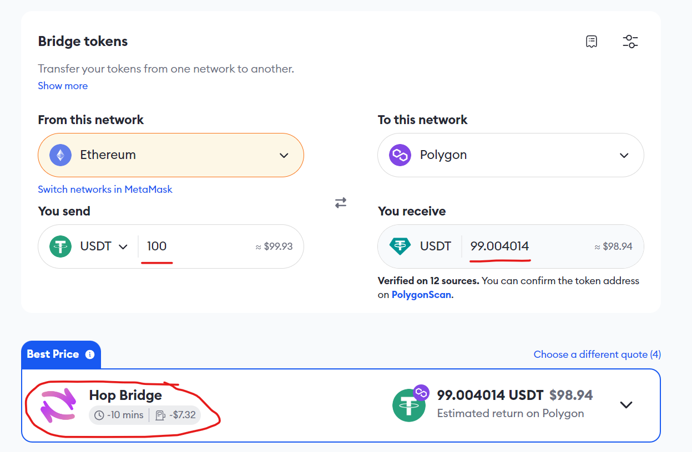
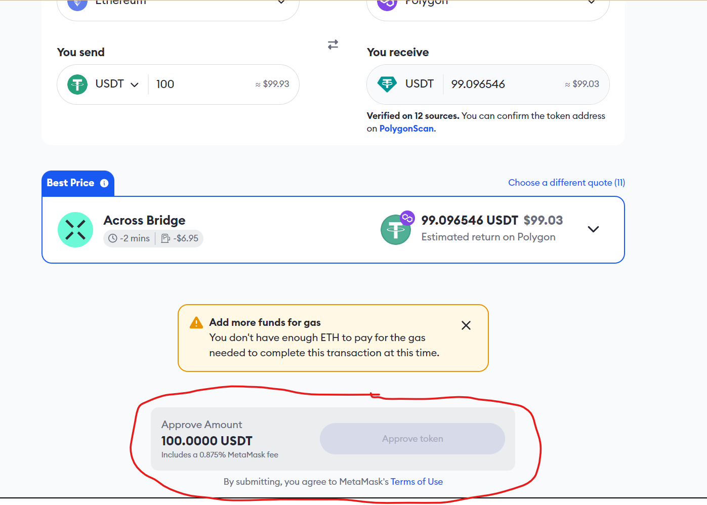
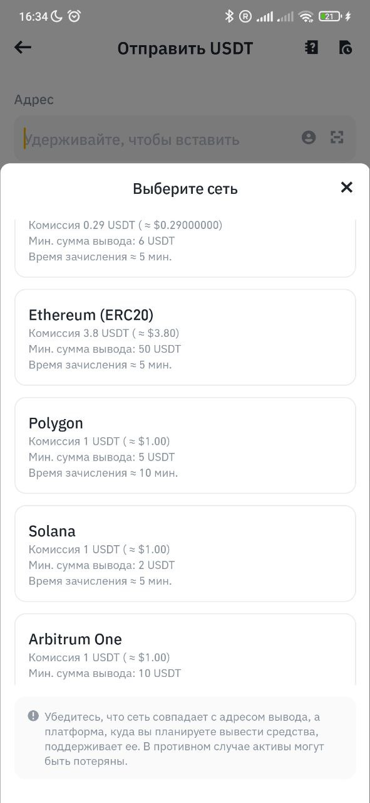

## Интсрукция для пользователей Metamask.

После этого дождитесь завершения операции в вашем кошельке и вы сможете обменять свои токены на Рубины в игре.

## Интсрукция для отправки токенов в сети Polygon

Зарегестрируйтесь на любой бирже криптовалют (Binance, Gate, Bybit, Mex).

Купите (USDT, USDC, DAI) любым удобным для вас способом (через P2P или иным).

